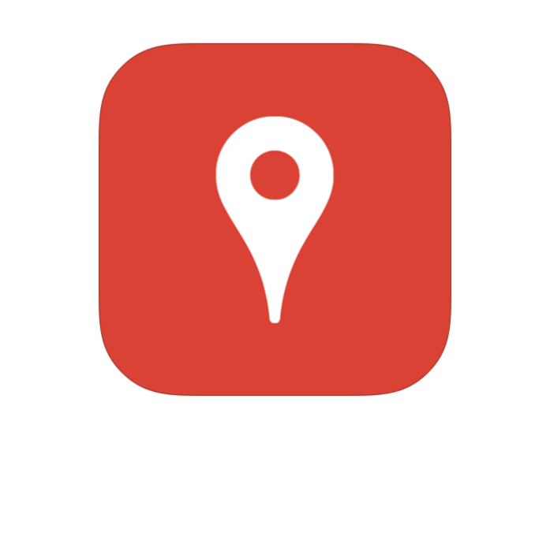

<div align="center">
    
</div>

# Description
Sample Node.js application implementing RESTful API for getting information about places.


## App Structure
The application is mainly structured around the API endpoints. A brief description of the directories is given below:

 | Directory | Function                                                                                                                                                          |
|-----------|--------------------------------------------------------------------------------------------------------------------------------------------------------------------|
| Root      | Contains the bootstrap file for the project (app.js),  package.json, Dockerfile, licensing and other files.                                                        |
| api       | Contains the server code for handling requests made on the different endpoints. Each endpoint has its own separate routes, middleware, helper and controller files.|
| config    | Contains files that deal with project wide configuration.                                                                                                          |
| logs      | Contains the server logs.                                                                                                                                          |
| tests     | Contains all the unit tests.                                                                                                                                       |


## Logging
In this project logging is done using `Winston.js`. The different logging levels can be set inside the .env file by modifying the `LOG_LEVEL` variable. It can take the following values:
```
-1      // No logging
error
warn
info
verbose
debug
silly
```

# Running the application

## Using Docker
1. Populate the following variables inside the .env file
```shell
API_PORT=
LOG_LEVEL=
GOOGLE_PLACES_API_KEY=
```
2. Build the docker image
```shell
docker build --tag places:v1 .
```
3. Run the container exposing the port defined in the .env file earlier
```shell
docker run -it --publish 3000:3000 places:v1
```
4. Make a curl call to check server health
```shell
curl http://localhost:3000/v1/ping
```

## Manually
1. Populate the following variables inside the .env file
```shell
API_PORT=
LOG_LEVEL=
GOOGLE_PLACES_API_KEY=
```
2. Install the project dependencies
```shell
npm install
```
3. Start the application
```shell
npm start
```


